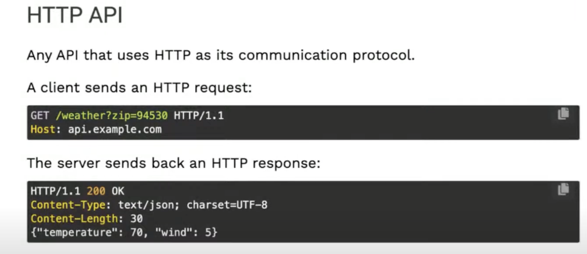
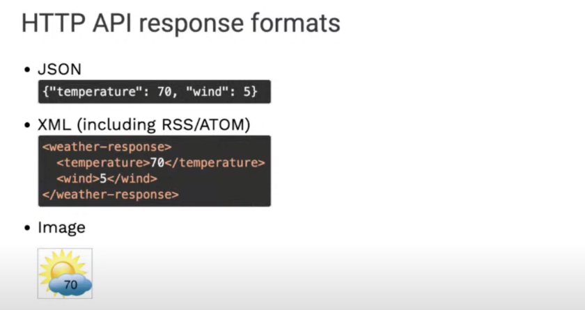
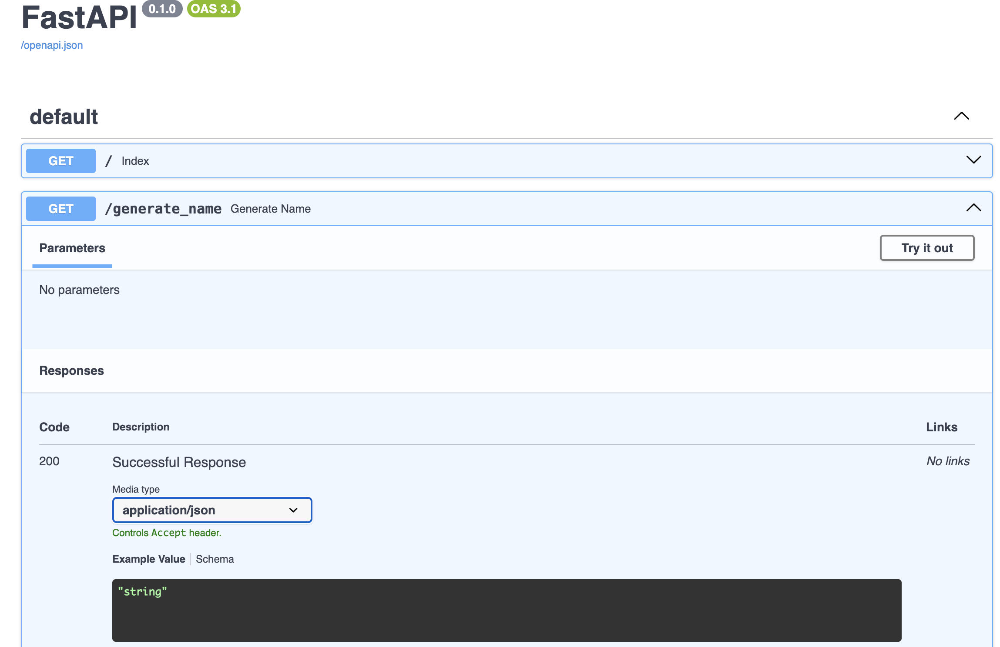
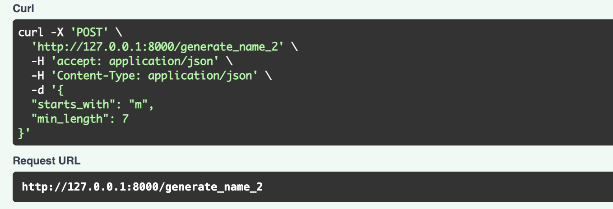
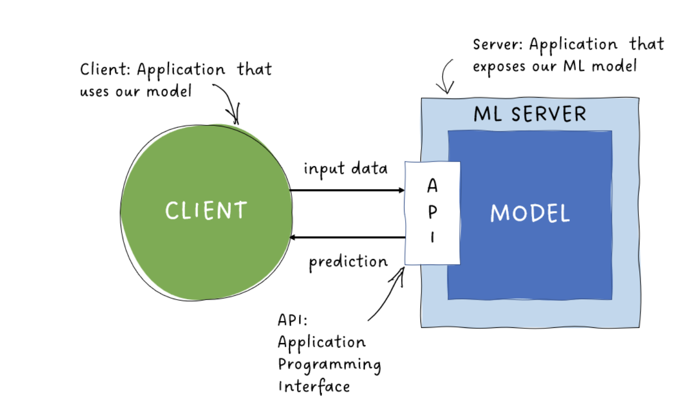
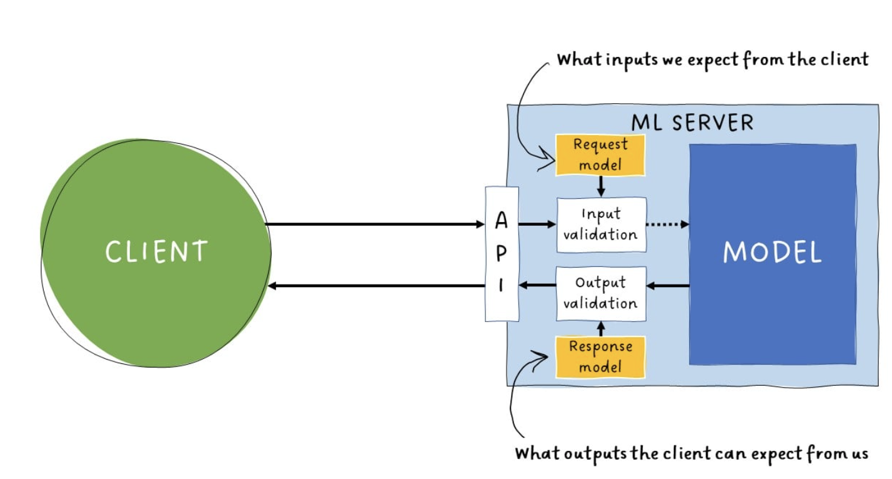
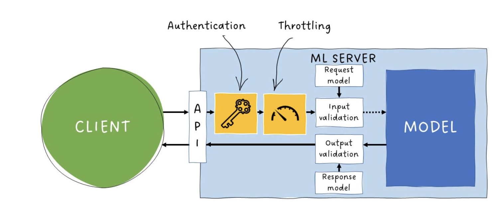

pip install -r requirements.txt

---------------------------------------------------------------------
# HTTP HyperText Transfer Protocol
This is what the web is built on 
- A client sends an HTTP request
- A server sends back an HTTP response. 

> inspect (dev tools in browser) > Network tab > all : to see all the requests that were made to load the page. 

## Action verb
- GET : retrieve data from a server (the client wants to get the web page)
- POST : send data to a server
- PUT : send data to a server, replacing existing data 
- PATCH : send data to a server, updating part of existing data 
- DELETE : delete data from a server

## HTTP Status code
- 200 successful
- 301 moved permanently (redirection)
- 401 not authorized
- 404 not found
- 500 Server error

---------------------------------------------------------------------
# HTTP API - api-urllib3.py

## API vs HTTP API

*API* = Application programming interface. 
A way for a program to talk to another program. 
Not all APIs are HTTP APIs 

*HTTP API* = any API that uses HTTP as its communication protocol. (a computer sends an HTTP request and another computer sends back an HTTP response, a program to another program).


## HTTP API response formats
- JSON (the most common)
- XML
- image


## HTTP APIs : GET vs. POST
- *GET* : retrieve data from a server. Often used with query parameters
- *POST* : send data to a server. Data is often in Json or for-encoded.(ex: google spreadsheet, the user sends data to the server). Will need some sort of authentication to know that it is OK for us to do such thing. 

## with python
package *requests* builtin package often used. Another one is used in the first example : urllib3

## Popular APIs : 
- social media: reddit, twitter, facebook Graph, instagram,
- productivity software : google workspace, microsoft graph, 
- non user data : google maps geocoding, amazon products, the movie DB, Openweather

## internal APIs
An API can also be setup solely for use by the company that made it. 
Many web sites have a separate codebase for their frontend and backend and all the communication happens over internal APIs. 
Internal APIs should still be documented and easy to use. 


## first example of calls to external APIs
pip install urllib3 rich
test-urllib3.py

---------------------------------------------------------------------
# Building an HTTP API with FastAPI - api-simple.py

https://fastapi.tiangolo.com/ fastapi documentation

FastAPI is a python framework designed specifically for building HTTP APIs. 
- fast to build and fast to execute, built on async instead of sync
- relies on python types (via pydantic)
- auto-generated documentation via swagger-UI
- based on the openAI specifications (OAS)

fastapi app are by default async. An all the routes of the API are async functions. An async function is also known as a coroutine. It is very important for enabling concurrency meaning that when we are running our async app, it is easier ofr a server to handle multiple users because, it can pause while it is doing like some IO and then it can handle another user. 
The function is decorated with the name of the app, the verb (get) and the route. 


in development environment : 
- fastapi dev scripts/test-fastapi-simple.py
- http://127.0.0.1:8000/generate_name api
- http://127.0.0.1:8000/docs auto generated documentation

in production mode : 
- fastapi run


test > try it out > execute : it is using the swagger UI documentation

## adding a parameter

when adding a parameter, you need to add a *type annotation* because fastapi is built on type annotations ! Also need to precise if the parameter is optional. Needed to do API validation and API documentation. Automatic API validation and error handling using types. 

## response format 
Could be JSON (the most common). But could also be an image or plain text...
for Json : ```return {"name": random_name}```
for plain text : ```return fastapi.responses.PlainTextResponses(random_name)```
for XML : ```return fastapi.responses.PlainTextResponses(f"<name>{random_name}</name>, media_type="application/xml")``` adn add -> str

## pydantic 
pydantic is used for the type annotation under the scene and for post requests to create the data model (BaseModel). 

## using get or post
Get is OK for public information as the parameters are passed in the URL as query parameters
--> parameters are in the route definition parameters
--> request URL : http://127.0.0.1:8000/generate_name_2?starts_with=m&min_length=7  

post is better for sensitive data as the parameter are passed in the body of the request. For a chat for example, the route should be a post as we don't want the conversation with the user to be public. 
--> parameters are in the request body using BaseModel to define.

--> request URL : http://127.0.0.1:8000/generate_name_2
--> request body : {"starts_with":"m", "min_length":7}

If there is any doubt, use post. 

## pass files to the API (file upload)
https://fastapi.tiangolo.com/tutorial/request-files/ 

---------------------------------------------------------------------
# Productionizing FastAPI apps

For production, you'll need a server that can handle : 
- handle ASGI (async) apps
- process multiple requests concurrently 

Options : 
- Gunicorn (WSGI + ASGI*)
- uvicorn (ASGI only)
- Hypercorn (ASGI only)

## Uvicorn
Uvicorn is a production level server specifically for Asgi apps. As of version 0.30.0 uvicorn can handle multiple workers. 
- run pip install uvicorn[standard]
- add :  uvicorn[standard] to requirements.txt 
- and run : uvicorn scripts.test-fastapi-simple:app --workers 4 --port 8000

## gunicorn
gunicorn in a production-level server that can run multiple worker processes. 
- run pip install uvicorn[standard] gunicorn
- add uvicorn[standard] to requirements.txt
- add gunicorn to requirements.txt
- python3 -m gunicorn scripts.test-fastapi-simple:app --workers 4 --worker-class uvicorn.workers.UvicornWorker --bind 0.0.0.0:8000
You have to tell it what wirker to work with.

When we are using gunicorn, we want to configure it in gunicorn.conf.py, to have an easier command : 
```python3 -m gunicorn scripts.test-fastapi-simple:app```

Similar with uvicorn, you can configure


---------------------------------------------------------------------
# api-translation.py

Using openAI api to create a translation API
enter a text to translate and output the translated text


---------------------------------------------------------------------
# api-model.py

The server can gives 2 kinds of services to the client : 
1. running procedures on the server (ex: provide a sentiment analysis API for Azure ML)
2. access remote databases (ex: Twitter, NY times API)


Input validation : via request model
output validation : via response model

Allow only specific clients to use our API and control aver the number of requests per time:



---------------------------------------------------------------------
# Full stack fastAPI - api-fullstack.py

Meaning using fastAPI For all your app !

## fastAPI + jinja 2
https://aka.ms/fastapi-postgres-app
https://github.com/Azure-Samples/azure-fastapi-postgres-flexible-services 

python3 -m uvicorn scripts.test-fullstack-fastapi:app --reload --port=8000

Example of a fast API page even though it is only serving HTML because not of the routes are actually an API as there are no parameters and are not returning Json. 

## use flask API with a database


---------------------------------------------------------------------
# Best practices
Cool library
rich library to print the result of a JSON
rich.print(response) # formats all the JSON

---------------------------------------------------------------------
# sources 
https://www.datacamp.com/tutorial/introduction-fastapi-tutorial
https://www.datacamp.com/tutorial/serving-an-llm-application-as-an-api-endpoint-using-fastapi-in-python 
https://www.datacamp.com/tutorial/python-backend-development

https://www.datacamp.com/tutorial/making-http-requests-in-python

Video Pamela Fox FastAPI
https://aka.ms/PWA-Series 
https://www.youtube.com/live/95Qwsi5cs78 

Repos used : 
aka.ms/python-web-apps-fastapi
aka.ms/fastapi-starter
aka.ms/fastapi-postgres-app
aka.ms/fastapi-azure-functions
aka.ms/fastapi-functions-apim

A reprendre :
https://www.youtube.com/watch?v=rkPIftzu1pQ 
https://app.datacamp.com/learn/courses/large-language-models-llms-concepts 