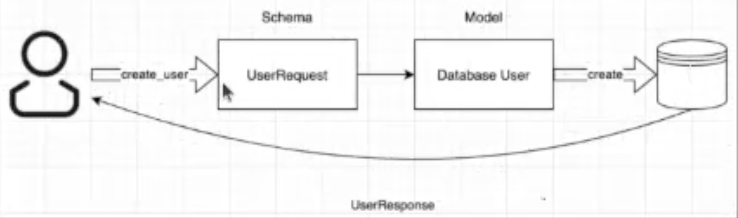
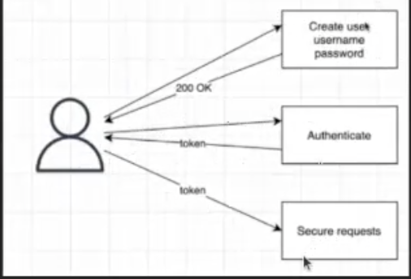

# API

## définition API
API = pour faire communiquer 2 programmes entre eux : soit le client et le serveur par exemple. Méthode de communication entre plusieurs constituants. 
- Basé sur  Requête - réponse. 
- API publiques ou privées 
- normes REST (principale) ou SOAP

## définition REST 
REST normes pour que ce soit reproductible et réutilisable : ensemble de normes, de lignes directrices architecturales sur comment on représente les API. C'est la principales norme (SOAP autre norme mais moins utilisées)
- basé sur HTTP

6 normes qui font le REST : 

1. *client / server  separation* : quelque soit le client ou le serveur le moyen de communication compte : ce que l'on met dans la requête et quel est le format de la réponse

2. *stateless* : le serveur ne sauvegarede aucune des requêtes ou réponses précédentes. La requête doit se suffire à elle même pour fournir la réponse. Les requêtes sont indépendantes entre elles. Le serveur ne garde pas les requêtes en mémoire. requêtes très spécifiques et détaillées donc très lisibles

3. *Cachable* : possibilité pour le client de mettre la réponse en cache. Fait gagner beaucoup de temps. (cas des Progressive Web APP). Que du côté client. Gain d'efficacité.

4. *Uniform interface* : interface uniforme: quand on crée une API reste on accepte d'utiliser les mêmes normes. On va donc comprendre n'importe quel API. 

5. *Layered system* : en couche : si un client se connecte à un composant intermédiaire, ne sait pas avec quel autre composant le sien va interagir. Chaque composant est suffisament indemendant. 

6. Code on demand. On peut demander au serveur le code 

## OPenAI Specification et Swagger
OpenAI specification (OAS - swagger specification) manière de définir les API. Format pour décrire les API Rest. Façon de les documenter. 
- endpoint
- opération disponibles pour chjaque endpoints
- paramètres
- méthode d'autentification
- - term d'utilisation

Swagger : construit autour de OAS
- éditeur
- UI

## Fast API framework python pour construire des APIs.
principal intérêt /docs au format swagger

### operations 
- GET
- POST
Décrites de façon différentes
- status code : code 200 quand tout va bien (successful response)
modifier le status de la page mais pas trop de sens car la page renvoi 404
modifier le status de la réponse dans l'objet réponse

- tag pour catégoriser les opérations

- en paramètre de l'opération (description, response_description), le décorateur

- en docstring

### METHODE GET

#### paramètres path - Méthode get : 
paramètre dans le chemin
path : chemin de l'URL : validation du type via pydantic library
/blog/12

#### paramètres prédéfinis
Définition avec Enum : /blog/type/story

#### Paramètres de requête (paramètres query = paramètres des fonctions)
S'ajoute au chemin après le ? 
Valeurs par défaut des paramètres dans la fonction qui rendent le paramètre optionnel. 

### ROUTER
structure l'application sur différentes routes : séparer les opérations en plusieus fichiers plus lisibles. 1 main qui regroupe tout. Refactoriser l'application. 

### METHODE POST 

#### paramètre path
#### paramètre query
#### paramètre body
pour passer les paramètres non pas dans la query mais dans la corps de la requête. BaseModel de pydantic qui convertit les données depuis le Json vers le modèle de l'API

Si on le passe en paramètre de la fonction -> query.
mais si basemodel, passe dnas le corps

### METADATA
Metadata pour ajouter titre description alias ou depreciation
Défini pour les paramètres

## ORM SQL ALCHEMY
plus pratique plus sécurisé. 

Concepts fast API = dépendances. une fonction dépend d'une autre fonction n'importe où dans le code : Depends est le constructeur qui fait çà. 
    def index(Depends(nomfonction)):

base de données

1 client veut créer un utilisateur
-  user request (définition du *schéma* de le requête)
- passées sous forme de database user (*Model*  dans la database: une classe)

Fonctionne avec une session. 
0. import libraisries
1. définition moteur de la BDD dans database.py 
2. Définition du modèles (champs de l'app, les tables) 
3. création dans le main.py des BDD
4. Définition des schémas
5. Définition des actions sur la table (comment on écrit dans la table)
6. Définition ds fonctionnalités de l'api d'un user(CRUD classique)
visualisation dans DBeaver avec SQL lite on crée une connection et ensuite on peut visualiser

Gestion des erreurs 

cookies variable que l'on peut stocker dans le navigateur

# authentification

Générer un token et authentifier l'utilisateur

## Sécuriser un endpoint
En demandant une dépendance dans la route à l'utilisation d'un token. 
authentication.py 

1 script oauth2.py création du token avec 
URl du token, endpoint qui va générer le token

1 script d'authentification.py qui récupère le token pour 

- un user récupéré par username dans authentification
- génération d'une token dand oauth.py

requests et pytest rajouté dans le requiremements.txt
test_main
crée un client test 

ya des requêtes qui prennent du temps et on ne veut pas bloquer le threads pendant que çà tourne : on peut dire à des fonctions de se mettre en attente
async devant une fonction 

api de base de données (ressources pour une bibliothèques lecteur / livres et la relation = emprunt). implémenter avec quelques
- date emprunt
- date de retour

- emprunter
- rendre un livre
- consulter emprunt
- consulter disponibilité
- toutes les crud 
- schéma de récupération des données
- authentification password 